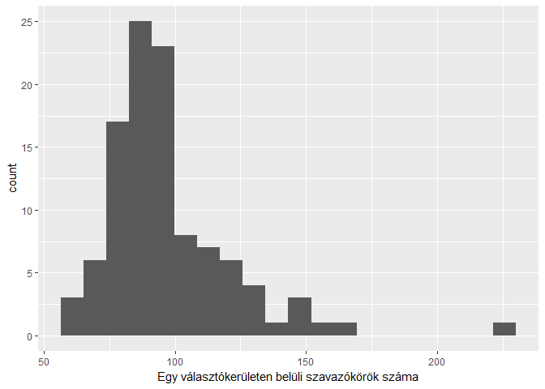
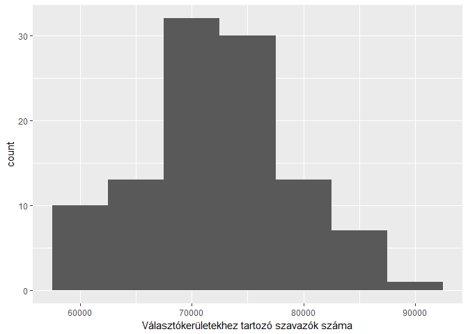
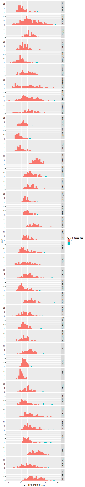
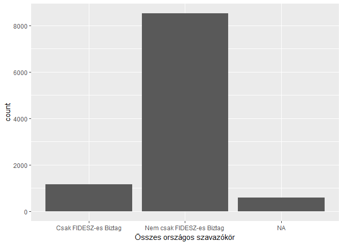
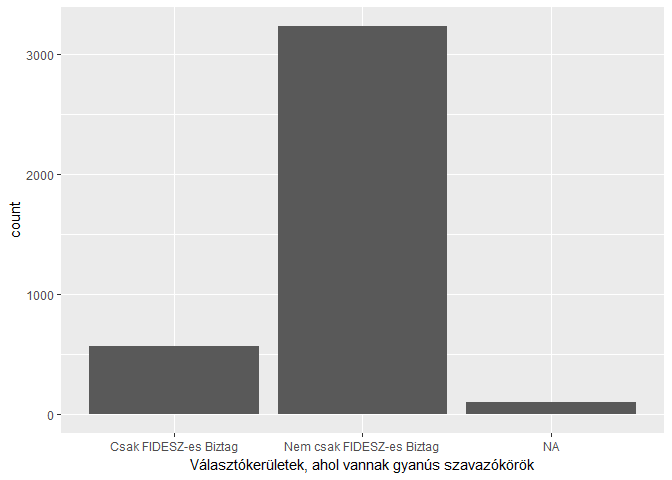
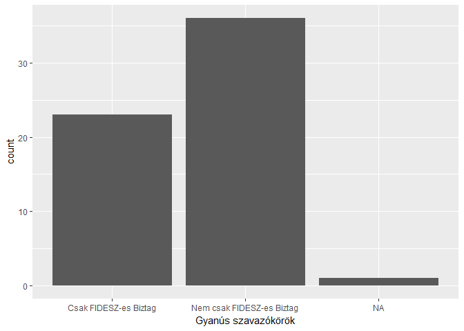

Valasztas
================
DemocracyGirl
April 11, 2018

Magyar országgyűlési választások elemzése
=========================================

Bevezető
--------

Ez a dokumentum egy elemzés a 2018 április 8-i országgyűlési választások eredményeiről. Az adatokat a <http://valasztasbigdata.tumblr.com> oldalról töltöttem le, és alapvető statisztikai elemzéseket végeztem el rajta.

Adatok beolvasása
-----------------

    ##   [1] "MegyeID"                                                         
    ##   [2] "Megye"                                                           
    ##   [3] "OEVK"                                                            
    ##   [4] "TelepID"                                                         
    ##   [5] "Telepules"                                                       
    ##   [6] "Szavazokor"                                                      
    ##   [7] "egyeni_Nevjegyzekben"                                            
    ##   [8] "egyeni_Megjelent"                                                
    ##   [9] "egyeni_Atjel..nevj."                                             
    ##  [10] "egyeni_Atjel..megj."                                             
    ##  [11] "egyeni_Atjel..boritek"                                           
    ##  [12] "egyeni_pecset.nelkul"                                            
    ##  [13] "egyeni_pecsettel"                                                
    ##  [14] "egyeni_tobblet.hiany"                                            
    ##  [15] "egyeni_ervenytelen"                                              
    ##  [16] "egyeni_ervenyes"                                                 
    ##  [17] "egyeni_..."                                                      
    ##  [18] "egyeni_A.HAZA.PARTJA"                                            
    ##  [19] "egyeni_AQP"                                                      
    ##  [20] "egyeni_CIVIL.MOZGALOM"                                           
    ##  [21] "egyeni_CSP"                                                      
    ##  [22] "egyeni_DEMOKRATA.PART"                                           
    ##  [23] "egyeni_DK"                                                       
    ##  [24] "egyeni_DMP"                                                      
    ##  [25] "egyeni_ECDP"                                                     
    ##  [26] "egyeni_EGYUTT"                                                   
    ##  [27] "egyeni_EMMO"                                                     
    ##  [28] "egyeni_EP"                                                       
    ##  [29] "egyeni_ERP"                                                      
    ##  [30] "egyeni_EU.ALTERNATIVA"                                           
    ##  [31] "egyeni_EU.ROM"                                                   
    ##  [32] "egyeni_FIDESZ.KDNP"                                              
    ##  [33] "egyeni_FITIP"                                                    
    ##  [34] "egyeni_FKGP"                                                     
    ##  [35] "egyeni_Fuggetlen.jelolt"                                         
    ##  [36] "egyeni_HAJRA.MAGYARORSZAG."                                      
    ##  [37] "egyeni_HAM"                                                      
    ##  [38] "egyeni_HAZA.MINDENKIE"                                           
    ##  [39] "egyeni_HHP"                                                      
    ##  [40] "egyeni_IMA"                                                      
    ##  [41] "egyeni_IRANYTU"                                                  
    ##  [42] "egyeni_JMP"                                                      
    ##  [43] "egyeni_JOBBIK"                                                   
    ##  [44] "egyeni_JO.UT.MPP"                                                
    ##  [45] "egyeni_KEDN"                                                     
    ##  [46] "egyeni_KPP"                                                      
    ##  [47] "egyeni_KOSSZ"                                                    
    ##  [48] "egyeni_KOZOS.NEVEZO"                                             
    ##  [49] "egyeni_LENDULETTEL"                                              
    ##  [50] "egyeni_LMP"                                                      
    ##  [51] "egyeni_MCP"                                                      
    ##  [52] "egyeni_MEDETE.PART"                                              
    ##  [53] "egyeni_MINOKP"                                                   
    ##  [54] "egyeni_MISZEP"                                                   
    ##  [55] "egyeni_MIEP"                                                     
    ##  [56] "egyeni_MKKP"                                                     
    ##  [57] "egyeni_MMM"                                                      
    ##  [58] "egyeni_MODERN.MAGYARORSZAG.MOZGALOM..MOMA."                      
    ##  [59] "egyeni_MOMENTUM"                                                 
    ##  [60] "egyeni_MSZP.PARBESZED"                                           
    ##  [61] "egyeni_MUNKASPART"                                               
    ##  [62] "egyeni_MVMP"                                                     
    ##  [63] "egyeni_NEEM"                                                     
    ##  [64] "egyeni_NEMZET.ES.BEKE"                                           
    ##  [65] "egyeni_NEMZETI.ZOLDEK"                                           
    ##  [66] "egyeni_NOP"                                                      
    ##  [67] "egyeni_NP"                                                       
    ##  [68] "egyeni_OCP"                                                      
    ##  [69] "egyeni_OP"                                                       
    ##  [70] "egyeni_OPRE.ROMA"                                                
    ##  [71] "egyeni_REND.PART"                                                
    ##  [72] "egyeni_SEM"                                                      
    ##  [73] "egyeni_SZEM.PART"                                                
    ##  [74] "egyeni_SZP"                                                      
    ##  [75] "egyeni_TAMP"                                                     
    ##  [76] "egyeni_EBMP"                                                     
    ##  [77] "egyeni_ERTUNK.ERTETEK"                                           
    ##  [78] "egyeni_UMF"                                                      
    ##  [79] "orszagos_nevjegyzekben"                                          
    ##  [80] "orszagos_megjelent"                                              
    ##  [81] "orszagos_pecset.nelkuli.lap"                                     
    ##  [82] "orszagos_pecsetelt.lap"                                          
    ##  [83] "orszagos_tobblet.hiany"                                          
    ##  [84] "orszagos_ervenytelen"                                            
    ##  [85] "orszagos_ervenyes"                                               
    ##  [86] "orszagos_CSALADOK.PARTJA"                                        
    ##  [87] "orszagos_DEMOKRATIKUS.KOALICIO"                                  
    ##  [88] "orszagos_EGYUTT...A.KORSZAKVALTOK.PARTJA"                        
    ##  [89] "orszagos_EUROPAI.ROMA.KERESZTENYEK.JOBBLETEERT.DEMOKRATIKUS.PART"
    ##  [90] "orszagos_FIDESZ...KDNP"                                          
    ##  [91] "orszagos_IRANYTU.PART"                                           
    ##  [92] "orszagos_JOBBIK.MAGYARORSZAGERT.MOZGALOM"                        
    ##  [93] "orszagos_KELL.AZ.OSSZEFOGAS.PART"                                
    ##  [94] "orszagos_KOZOS.NEVEZO.2018"                                      
    ##  [95] "orszagos_LEHET.MAS.A.POLITIKA"                                   
    ##  [96] "orszagos_MAGYAR.IGAZSAG.ES.ELET.PARTJA"                          
    ##  [97] "orszagos_MAGYAR.KETFARKU.KUTYA.PART"                             
    ##  [98] "orszagos_MAGYAR.MUNKASPART"                                      
    ##  [99] "orszagos_MAGYAR.SZOCIALISTA.PART....PARBESZED.MAGYARORSZAGERT"   
    ## [100] "orszagos_MAGYARORSZAGI.CIGANYPART"                               
    ## [101] "orszagos_MAGYARORSZAGON.ELO..DOLGOZO.ES.TANULO..EMBEREK.PARTJA"  
    ## [102] "orszagos_MOMENTUM.MOZGALOM"                                      
    ## [103] "orszagos_NET.PART"                                               
    ## [104] "orszagos_REND.ES.ELSZAMOLTATAS.PART"                             
    ## [105] "orszagos_SPORTOS.ES.EGESZSEGES.MAGYARORSZAGERT.PART"             
    ## [106] "orszagos_SZEGENY.EMBEREK.MAGYARORSZAGERT.PART"                   
    ## [107] "orszagos_TENNI.AKARAS.MOZGALOM"                                  
    ## [108] "orszagos_OSSZEFOGAS.PART"                                        
    ## [109] "nemzetisegi_nevjegyzekben"                                       
    ## [110] "nemzetisegi_megjelent"                                           
    ## [111] "nemzetisegi_pecset.nelkuli.lap"                                  
    ## [112] "nemzetisegi_pecsetelt.lap"                                       
    ## [113] "nemzetisegi_tobblet.hiany"                                       
    ## [114] "nemzetisegi_ervenytelen"                                         
    ## [115] "nemzetisegi_ervenyes"                                            
    ## [116] "nemzetisegi_Bolgar"                                              
    ## [117] "nemzetisegi_Gorog"                                               
    ## [118] "nemzetisegi_Horvat"                                              
    ## [119] "nemzetisegi_Lengyel"                                             
    ## [120] "nemzetisegi_Nemet"                                               
    ## [121] "nemzetisegi_Roma"                                                
    ## [122] "nemzetisegi_Roman"                                               
    ## [123] "nemzetisegi_Ruszin"                                              
    ## [124] "nemzetisegi_Szerb"                                               
    ## [125] "nemzetisegi_Szlovak"                                             
    ## [126] "nemzetisegi_Szloven"                                             
    ## [127] "nemzetisegi_Ukran"                                               
    ## [128] "nemzetisegi_Ormeny"

Választókerületen belüli eltérések elemzése
-------------------------------------------

A megye és az OEVK változók kombinációjából létrehozok egy-egy teljesen független választókerületet jelölő változót. Majd létrehozok egy új oszlopot, ami a külön szavaz szavazóköröknek ad egy unique id-t.

``` r
vdata$valker_id<-paste(vdata$Megye,vdata$OEVK)
#Szavazokor ID, kesobb hasznaljuk a bizottsagi tagok tablaval valo egyesitesben
vdata$szavkor_id<-ifelse(vdata$Megye=="BUDAPEST",paste("BUDAPEST",vdata$TelepID,vdata$Szavazokor), paste(iconv(toupper(vdata$Telepules),to='ASCII//TRANSLIT'),vdata$Szavazokor))
```

Ellenőrizzük, hogy tényleg 106 választókerület jött ki.

``` r
table(vdata$valker_id) %>% nrow()
```

    ## [1] 106

A lentebbi grafikonon az látható, hogy egy-egy független választükerületben hány szavazókör van. Ahogy láthatjuk, egyetlen kirívó választókerület van, ahol több, mint 200 db szavazókör van. Ez a kirívóan fregmentált választókerület a Baranya megyei 4-es választókerület, ahova 225 szavazókör tartozik. Országosan átlagosan 97 szavazókör tartozik egy választókerülethez.



    ## [1] 97.0283

    ## # A tibble: 1 x 1
    ##   valker_id
    ##       <chr>
    ## 1 BARANYA 4

Érdekes megvizsgálni, hogy egy-egy választókerülethez hány ember tartozik. A lenti hisztogram mutatja az eloszlást, és azt, hogy átlagosan egy választókerülethez 72000 ember tartozik. Ebből kiugró egy 90000 fő felett számláló választókerület, méghozzá PEST 5.



    ## [1] 72410.04

    ## # A tibble: 6 x 2
    ##   valker_id count
    ##       <chr> <int>
    ## 1    PEST 2 87203
    ## 2    PEST 3 85287
    ## 3    PEST 5 91122
    ## 4    PEST 6 85531
    ## 5    PEST 7 85943
    ## 6    PEST 8 86549

Vizsgáljuk meg, hogy egy választókerületen belül milyen eltérések vannak az egyes szavazókörök eredményei között. Homogének a szavazókörök? Tételezzük fel, hogy egy választókerületen belül az adott FIDESZ-es politikus minden egyes szavazókörben ugyanannyira szimpatikus. Így minden szavazókörben a szavazatok ugyannyi százalékát kellene kapnia a statisztikai hibahatáron belül mozogva.

Létrehozok egy új változót, ami az adott szavazókörön belüli FIDESZ egyéni szavazatok százalékos arányát mutatja.

Majd létrehozok egy táblázatot, ami az adott teljes választókerületen belül összesíti az érvényes egyéni szavazatok számát, a FIDESZ-re leadott egyéni szavazatok számát, és így a FIDESZ egyéni szavazatok százalékos arányát. Egy külön oszlopban tartom számon a választókerületen belüli szavazókörök FIDESZ-re szavazás arányának szórását (standard deviation).

Csinálok egy új táblát, amiben benne van a választókerület, az adott szavazókörben hány százalékos volt a FIDESZ támogatottsága, és az adott teljes választókerületben átlagosan hány százalékos volt a FIDESZ támogatottság, és mennyi volt ennek a támogatottságnak a választókerületen belüli szórása.

Gyanús esetek és anomáliák
--------------------------

Flageljuk meg azokat a szavazóköröket, amiknél gyanúsan magas a FIDESZ-es egyéni jelöltre szavazók aránya. Ez azt jelenti, hogy olyan szavazóköröket keresünk, ahol legalább három szórásnyival többen szavaztak a FIDESZ-re, mint átlagosan a teljes választókerületben. Ez statisztikailag az esetek 0.1%-ban fordulhatna elő

Mivel 10000 szavazókör van, ha normál eloszlást mutatna a választókerületeken belüli szavazatok megoszlása, akkor körülbelül 10 ilyen esetnek kellene előfordulnia. Ezzel szemben 60 ilyen kerület van. Ez lehet természetesen azért, mert a szavazóköröket szándékosan így alakították ki, de utalhat helyi szinten "abnormális" mértékű FIDESZ szavazó mozgósításra.

    ##                 valker_id           szavkor_id
    ## 1             BUDAPEST 13       BUDAPEST 16 54
    ## 2               BARANYA 2            BERKESD 1
    ## 3               BARANYA 2       KOVAGOSZOLOS 2
    ## 4               BARANYA 2            PEREKED 1
    ## 5               BARANYA 4              PISKO 1
    ## 6                 BÉKÉS 2           SZARVAS 17
    ## 7                 BÉKÉS 4          OROSHAZA 37
    ## 8                 BÉKÉS 4      PUSZTAOTTLAKA 2
    ## 9  BORSOD-ABAÚJ-ZEMPLÉN 1         ALSOZSOLCA 3
    ## 10 BORSOD-ABAÚJ-ZEMPLÉN 1         ALSOZSOLCA 5
    ## 11 BORSOD-ABAÚJ-ZEMPLÉN 3               OZD 29
    ## 12 BORSOD-ABAÚJ-ZEMPLÉN 3       TORNANADASKA 1
    ## 13 BORSOD-ABAÚJ-ZEMPLÉN 4                FAJ 1
    ## 14 BORSOD-ABAÚJ-ZEMPLÉN 5        FELSOREGMEC 1
    ## 15 BORSOD-ABAÚJ-ZEMPLÉN 6           KISCSECS 1
    ## 16             CSONGRÁD 1         KLARAFALVA 1
    ## 17             CSONGRÁD 1        TISZASZIGET 2
    ## 18                FEJÉR 4              ERCSI 6
    ## 19                FEJÉR 4              ERCSI 8
    ## 20    GYOR-MOSON-SOPRON 3            VADOSFA 1
    ## 21    GYOR-MOSON-SOPRON 4             SARROD 1
    ## 22    GYOR-MOSON-SOPRON 5           CAKOHAZA 1
    ## 23    GYOR-MOSON-SOPRON 5          RABCAKAPI 1
    ## 24          HAJDÚ-BIHAR 1         DEBRECEN 115
    ## 25          HAJDÚ-BIHAR 2          DEBRECEN 26
    ## 26          HAJDÚ-BIHAR 3          NYIRADONY 8
    ## 27          HAJDÚ-BIHAR 6     BALMAZUJVAROS 17
    ## 28                HEVES 1          KERECSEND 2
    ## 29                HEVES 1              KOMLO 2
    ## 30                HEVES 2             SZAJLA 1
    ## 31                HEVES 3              HEVES 9
    ## 32 JÁSZ-NAGYKUN-SZOLNOK 1          TISZAJENO 2
    ## 33 JÁSZ-NAGYKUN-SZOLNOK 3            TISZABO 1
    ## 34 JÁSZ-NAGYKUN-SZOLNOK 3            TISZABO 2
    ## 35 JÁSZ-NAGYKUN-SZOLNOK 3          TISZABURA 2
    ## 36 JÁSZ-NAGYKUN-SZOLNOK 4          TISZAKURT 2
    ## 37    KOMÁROM-ESZTERGOM 1          TATABANYA 4
    ## 38    KOMÁROM-ESZTERGOM 1          TATABANYA 5
    ## 39    KOMÁROM-ESZTERGOM 2               EPOL 1
    ## 40                 PEST 7            VECSES 10
    ## 41                 PEST 8          MAJOSHAZA 1
    ## 42                 PEST 9               DANY 4
    ## 43                 PEST 9               TURA 2
    ## 44                PEST 11              BUGYI 6
    ## 45               SOMOGY 1            GALOSFA 1
    ## 46               SOMOGY 1             HAJMAS 1
    ## 47               SOMOGY 1          KAPOSVAR 55
    ## 48               SOMOGY 1 SZILVASSZENTMARTON 1
    ## 49               SOMOGY 3           PALMAJOR 1
    ## 50               SOMOGY 3          SOMOGYVAR 3
    ## 51               SOMOGY 4             ECSENY 1
    ## 52               SOMOGY 4             KAZSOK 1
    ## 53                  VAS 1              BUCSU 1
    ## 54                  VAS 1         HORVATLOVO 1
    ## 55                  VAS 1              NARDA 1
    ## 56                  VAS 1       VASKERESZTES 1
    ## 57                  VAS 2             SARVAR 5
    ## 58             VESZPRÉM 3            HOSZTOT 1
    ## 59             VESZPRÉM 4             ISZKAZ 1
    ## 60             VESZPRÉM 4           KISPIRIT 1

    ## [1] 60

Ezeket a gyanús szavazóköröket rárakva egy grafikonra a választókerületen belüli többi szavazókör eredményeivel együtt:

    ## Warning: Removed 38 rows containing non-finite values (stat_bin).



Hasonlóan megvizsgálhatjuk azokat a szavazóköröket, ahol a várhatónál kevesebben szavaztak a FIDESZ-re. Tehát legalább - a választókerületen belüli - három szórásnyival kevesebben szavaztak itt a FIDESZ-re, mint az átlag. Ilyen kerületból 6 db van.

    ## [1] 6

A választási bizottság összetétele
----------------------------------

Vessük össze a fentieket azzal, hogy milyen volt a választási bizottság összetétele.

Ellenőrizzük, hogy egy választási bizottságban átlagosan hány szavazatszámláló, illetve választási bizottsági tag van. (3,4 fő)

    ## [1] 3.356443

Ebből FIDESZ-es kicsivel több, mint másfél.

    ## [1] 1.591355

Azoknak a szavazóköröknek az aránya, ahol csak FIDESZ-es bizottsági tag van 12%:

    ## [1] 0.120912

Vizsgájuk meg, hogy az előbbi, "gyanúsan magas" FIDESZ szavazókörökben mennyi volt a csak FIDESZ-es bizottsági tag által felügyelt körzet. Összesen 23, ami az összes (60 db) gyanús körzet közel 40%-a!

    ## # A tibble: 1 x 1
    ##       n
    ##   <int>
    ## 1    23

A részrehajlást csökkentendő, csak azokat a választókerületeket nézve, ahol volt legalább egy gyanús szavazókör, ez az arány 14.5%. Tehát megállapítható, hogy a gyanúsan magas arányú FIDESZ szavazatot kapó szavazóköröknél szinte háromszor nagyobb aránnyal fordul elő olyan eset, hogy CSAK FIDESZ-es választási bizottsági tag felügyelte a munkát.

    ##           n
    ## 1 0.1450578

Az előbbi adatokat grafikonon ábrázolva:



TL;DR
-----

Azokban a szavazókörökben, ahol gyanúsan magas volt a FIDESZ szavazók aránya (az azonos választókerületben lévő többi szavazókörhöz viszonyítva) 3-szor nagyobb eséllyel ült csak FIDESZ-es bizottsági tag.

Egyes esetek megvizsgálása
--------------------------

Végigpörgetve a kirívó eseteket:
\* A BUDAPEST XVI. kerület 54-es szavazókörben a FIDESZ-re egyéni-listás szavazatok száma 459-362, tehát az egyéni-listás FIDESZ szavazatok aránya 1.26. Ezzel szemben a teljes XVI. kerületben ez az arány 1.04, minimális szórással. Szinte biztos, hogy rosszul lettek számolva a szavazatok.
\* Berkesden (Baranya 2) a FIDESZ a listásnál az egyéniben 37%-kal nagyobb támogatottságát (262-191) valószínűleg a 76 mozgósított nemzetiséginek köszönheti, akik közül - bár a nemzetiségi névjegyzékben vannak feltűntetve - 27-en nem szavaztak érvényesen a nemzetiségi listára (2-nek nem is volt lepecsételve a szavazólapja). Itt csak FIDESZ-es volt a bizottsag.
\* Hasonló a helyzet szintén Kővágószőlős 2-n, ahol az arányok 14% (152-133), 18 nemzetiségi, ebből 12 érvényes nemzetiségi listás szavazat (12 roma); valamint Perekeden (70-31), ahol 45 nemzetiségi, 39 ervenyes nemzetisegi listas (30 nemet, 9 roma), es csak FIDESZ-es bizottsag volt.
\* Piskón (Baranya 4) a 139 egyéni és listás érvényes szavazatokkal egyéniben 132-et, listán 132-t tudott behozni a FIDESZ. Ez egyéniben 96%-os támogatottság, míg az egész Baranya 4-ben ez az arány átlagosan 54%. Megjegyzem, ez pont egy olyan szavazókör, ahol csak FIDESZ-es bizottsági tag volt.
\* Alsózsolca 1, 2 és 4-es szavazókörökben a BORSOD 1 választókerülethez hasonlóan a FIDESZ egyéni szavazatok aránya 40% körül van. Ezzel szemben, Alsózsolca 3 és 5 szavazókörökben kiemelkedően magas FIDESZ támogatottság van, 67% és 64%, és a szavazatok szinte kizárólag a Jobbiktól lettek "átcsoportosítva". Ezekben a körzetekben a megjelentek aránya is sokkal alacsonyabb, Alsózsolca 1, 2 és 4-ben 74%, 73%, 71,5%-kal szemben Alsózsolca 3, 5-ben 63% és 59%. Az érvénytelen szavazatok aránya elég magas, Alsózsolca 5-ben például 4%. Erre a jelenségre nem találtam választ...volt többféle pártból is delegált. Van valami demográfiai oka ennek? **Azért is érdekes lenne kideríteni, mert pont BORSOD 1-ben 127 szavazatkülönbséggel nyert csak a FIDESZ.**
\* Szajla 1 és 2 (Heves 2) között is hasonló jellegű a különbség, Szajla 1 szavazókörben 89%-os a FIDESZ támogatottság, míg Szajla 2-ben mindössze 63%. Szajla 1-ben és 2-ben is csak FIDESZ-es volt egyébként a szavazatszámláló bizottság tagja.
\* ... Sajnos idő hiányában nem tudom a többi "gyanús" szavazókört átnézni.
